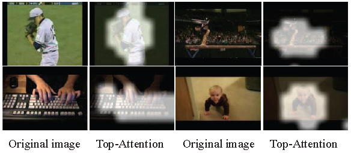
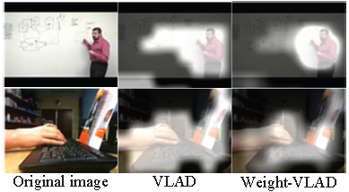

# [Top Attention in Line with Time: A Light-weight Strategy](http://ieeexplore.ieee.org/document/8019360/)


This repository is the source code of "[Top Attention](http://ieeexplore.ieee.org/document/8019360/)". The code is tested on the Ubuntu 14.04 and matlab 2014a. 


## Requirments
- System: Ubuntu 14.04
- Matlab 2014a
- [vlfeat 0.9.20](http://www.vlfeat.org/)
- [caffe](http://caffe.berkeleyvision.org/tutorial/interfaces.html)


## pretrained model
- TODO

## running

- ./extract_ucf_ldd_res.m : extract the 'Line-pooled Deep-convolutional Descriptors (LDD)' 
- ./extract_ucf_ldd_tw_topweight_res.m : extract the descriptors and the 'top weights'
- ./vlad/vl_main.m : run 'Vlad' with LDD
- ./vlad_w/vl_main.m : run 'Weight-Vlad' with LDD


## Examples
- Visualization of Top Attention. The LDDs from the bright regions will be reserved, while others will be filtered. We can find that most removed LDDs belong to background.


- Comparison of VLAD and Weight-VLAD. The left column shows the original images. The middle column shows that VLAD aggregates the differences between reserved descriptors and the corresponding centers. The right column shows that the Weight-VLAD can focus on the key regions.


- Visualizations of Top Attention. The brighter a region is, the more salient a motion of action is along the time line.


## Paper

Youjiang Xu, Shichao Zhao, [Yahong Han](http://cs.tju.edu.cn/faculty/hanyahong/), Qinghua Hu, Fei Wu. "[Top Attention in Line with Time: A Light-weight Strategy](http://ieeexplore.ieee.org/document/8019360/)". ICME. 2017.


```
	@inproceedings{xu2017top,
	  title={Top attention in line with time: A light-weight strategy},
	  author={Xu, Youjiang and Zhao, Shichao and Han, Yahong and Hu, Qinghua and Wu, Fei},
	  booktitle={Multimedia and Expo (ICME), 2017 IEEE International Conference on},
	  pages={295--300},
	  year={2017},
	  organization={IEEE}
	}
```
